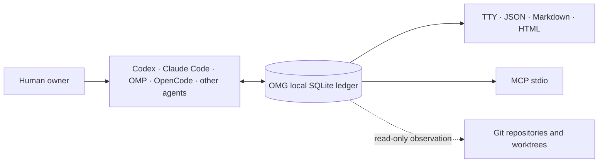

<div align="center">

# OMG

### The local coordination layer for AI coding agents.

**Coordinate parallel work. Recover context. Verify completion.**

[](go.mod)
[](LICENSE)


<sub>Codex · Claude Code · OMP · OpenCode · Gemini · Cursor · Windsurf · Cline · shell agents</sub>

[Quickstart](#quickstart) · [Why OMG](#why-omg) · [How it works](#how-it-works) · [Safety](#safety-boundary) · [Documentation](#documentation)

</div>

> [!IMPORTANT]
> OMG is open-source under Apache-2.0 and currently pre-1.0. No stable binary release has been published yet; install from source and treat `main` as an evolving contract.

OMG is **not another coding agent**. It is the durable coordination and recovery layer beneath the agents you already use.

It keeps lineage, tasks, runs, progress, dependencies, messages, handoffs, advisory path reservations, and observed Git state in one local SQLite ledger—without replacing your runtime, copying native transcripts, or taking control of Git.

## Why OMG

Coding agents are fast. Multi-agent work is not automatically coordinated.

| Without OMG | With OMG |
| --- | --- |
| Session context disappears when a chat ends. | Resumed and delegated sessions retain explicit lineage and handoff history. |
| Parallel workers silently overlap. | Advisory path reservations and dependency state make conflicts visible. |
| “Done” can mean “the agent stopped typing.” | `WORK_COMPLETE` stays separate from independently accepted `VERIFIED_DONE`. |
| Tasks, messages, Git state, and evidence live in different tools. | One canonical ledger renders the same redacted state as TTY, JSON, Markdown, or HTML. |
| Coordination logic is coupled to one harness. | Runtime-neutral commands work across Codex, Claude Code, OMP, OpenCode, MCP clients, and shell agents. |

## Quickstart

### 1. Install from source

Requires Go 1.26 or the version declared in [`go.mod`](go.mod).

```bash
go install github.com/jeremy-merchant/OMG/cmd/omg@main
omg agent install
omg agent doctor
```

`omg agent install` adds bounded OMG instructions and always-on skills to supported agent discovery locations. The agent—not the human—then performs routine preflight, coordination, progress, and handoff steps.

### 2. Initialize a project safely

`omg init` creates the project configuration and state location. The next `preflight` automatically applies every exact pending migration compiled into the installed OMG binary. Before changing schema, OMG creates and verifies the plan-bound backup, applies atomically, and checks integrity. Unknown, stale, checksum-divergent, backup-failed, or integrity-failed plans remain blocked rather than asking for approval.

```bash
PROJECT=/absolute/path/to/your/project

omg init --project "$PROJECT" --json
omg preflight --project "$PROJECT" --json
```

Normal initialization needs no approval file. `migration plan`, `backup create`, and the legacy manual `migration apply` command remain available for diagnostics and controlled recovery. The automatic backup policy and failure procedure are documented in the [operator guide](docs/OPERATIONS.md#initialization-and-schema-lifecycle).

### 3. See the project

```bash
omg preflight --project "$PROJECT"
omg board all --project "$PROJECT" --format tty
omg export html --project "$PROJECT" --output "$PROJECT/omg-board.html"
```

The HTML board is static, self-contained, network-free, and written only to a new destination.

## What OMG tracks

| Surface | What it preserves |
| --- | --- |
| **Lineage** | Human root, controller, delegated workers, continuations, and native-session references. |
| **Work** | Tasks, runs, progress, dependencies, blockers, and acceptance state. |
| **Coordination** | Typed messages, inbox state, acknowledgements, and advisory path reservations. |
| **Handoffs** | Immutable summaries, changed files, verification evidence, remaining risks, and suggested next actions. |
| **Git observation** | Repository, branch, worktree, dirty/ahead/behind state, ownership signals, and classifications. |
| **Recovery** | Durable checkpoints and canonical state that survive interrupted or resumed sessions. |

## How it works



- **Local-first:** canonical mutable state lives outside Git in an owner-scoped SQLite store.
- **Daemonless by default:** no background service, cloud account, Node runtime, Python runtime, or shared SQLite library is required.
- **Runtime-neutral:** agents can use the global discovery harness, explicit wrappers, shell helpers, or the MCP stdio adapter.
- **One projection:** every renderer starts from the same canonical, redacted snapshot.

## Use it from any harness

Install once, then let supported agents discover OMG automatically:

```bash
omg agent install
omg agent status
```

Wrap an existing runtime explicitly when you need a bounded entry point:

```bash
omg run --runtime codex -- codex
omg run --runtime claude -- claude
```

Expose the same command policy over newline-delimited MCP JSON-RPC 2.0:

```bash
omg mcp serve --stdio
```

Controllers launching parallel OMP lanes can pre-register each worker and inject exact project, session, task, controller, and human identity:

```bash
omg worker bootstrap \
  --idempotency-key bootstrap-worker-1 \
  --output /absolute/private/worker-1.env \
  --json
```

See the [worker bootstrap guide](docs/WORKER_BOOTSTRAP.md) for the controller contract and shell-safe cmux/OMP launch pattern.

## Command map

| Goal | Command |
| --- | --- |
| Check health before work | `omg preflight` |
| See active work and blockers | `omg board all` |
| Inspect one worker's scope | `omg board me` |
| Inspect one task | `omg board task --task TASK_ID` |
| Diagnose the global harness | `omg agent doctor` |
| Generate shell helpers | `omg shell-init bash` |
| Generate completions | `omg completion zsh` |
| Export a reviewable board | `omg export html --output board.html` |

Running `omg` with no arguments prints a concise discovery view. A bare namespace such as `omg task` or `omg board` opens contextual help; `omg --help` prints the full global contract.

## Safety boundary

OMG coordinates and observes. It does **not** silently acquire authority.

| OMG does | OMG does not |
| --- | --- |
| Record lineage, work, messages, handoffs, reservations, and evidence. | Grant commit, push, deploy, credential, production, deletion, or publication authority. |
| Observe repositories and worktrees. | Commit, merge, rebase, push, reset, clean, delete, or remove branches/worktrees. |
| Redact raw prompts, message bodies, final output, tokens, private paths, and secret-like values by default. | Treat messages, model output, handoffs, tokens, or `VERIFIED_DONE` as human approval. |
| Distinguish self-reported completion from independent verification. | Collapse `WORK_COMPLETE` and `VERIFIED_DONE` into one state. |

Additional guarantees:

- Every exact migration compiled into the installed binary is eligible for backup-verified automatic application; unknown, stale, checksum-divergent, backup-failed, and integrity-failed plans fail closed.

- Native conversation transcripts remain in their source runtime.
- `.omg/` contains only tracked-safe configuration and operator-created plan/approval files; canonical mutable state stays outside Git.
- File output is owner-only and refuses to overwrite an existing path.
- `SAFE_TO_REMOVE` is a classification, never authorization.

Read the [security policy](SECURITY.md), [privacy contract](docs/PRIVACY.md), and [threat model](docs/THREAT_MODEL.md) before integrating OMG into automated workflows.

## Build from this checkout

Release binaries are built with `CGO_ENABLED=0`.

```bash
go build -trimpath -o ./bin/omg ./cmd/omg
./bin/omg version --json
./bin/omg release status --json
```

The expected source status is `SOURCE PUBLISHED`; `stable_release` remains `false` until a tagged stable release is created.

The deterministic hostile-input preview exercises every presentation without touching canonical state:

```bash
go run ./examples/board-preview --format tty --output -
go run ./examples/board-preview --format html --output board-preview.html
go run ./examples/board-preview --format markdown --output board-preview.md
go run ./examples/board-preview --format json --output board-preview.json
```

## Documentation

| Guide | Covers |
| --- | --- |
| [Operator guide](docs/OPERATIONS.md) | Storage, migrations, backup/recovery, watch, MCP, privacy, and troubleshooting. |
| [Command reference](docs/COMMAND_REFERENCE.md) | Command syntax, payloads, JSON envelopes, and stable exit codes. |
| [Global agent installation](docs/GLOBAL_AGENT_INSTALL.md) | Discovery surfaces, offline candidates, uninstall behavior, and release contract. |
| [Worker bootstrap](docs/WORKER_BOOTSTRAP.md) | Controller registration, worker startup, and cmux/OMP launch patterns. |
| [Adapter guide](docs/ADAPTERS.md) | Runtime wrappers, shell integration, watch, MCP, and native-session metadata. |
| [Interface research](docs/INTERFACE_RESEARCH_2026.md) | 2026 CLI research, OMP source audit, accessibility decisions, and measurements. |
| [Product specification](docs/PRODUCT_SPEC.md) | Product scope, ontology, release gates, and acceptance requirements. |
| [Acceptance matrix](docs/ACCEPTANCE_MATRIX.md) | Executable product, safety, portability, and recovery evidence. |

## Contributing

Contributions are welcome. Start with [`CONTRIBUTING.md`](CONTRIBUTING.md), follow the [Code of Conduct](CODE_OF_CONDUCT.md), and report sensitive issues through [`SECURITY.md`](SECURITY.md).

## License

OMG is licensed under the [Apache License 2.0](LICENSE).
