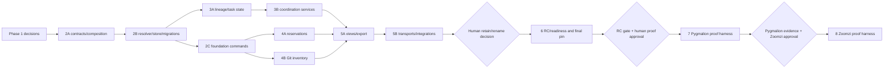

# OMG v0.1 Implementation Plan

**Status:** execution plan; no implementation, adapter mutation, publication, or legal clearance is authorized by this document.  
**Authority:** `docs/PRODUCT_SPEC.md` is the stable product authority. The master spec, acceptance matrix, accepted ADRs 0001–0003, security/privacy/threat contracts, reuse decision, and working-name research are binding supporting authorities.
**Public identity:** OMG / `omg` / `.omg/` / `OMG_` / OMGCP. Source publication was authorized on 2026-07-25 under Apache-2.0; no stable binary release exists yet.

## 1. Non-negotiable execution rules

1. Build greenfield Go/SQLite. Reuse concepts only; do not copy upstream code, layouts, tests, prompts, CLI spelling, or expressive text. Pin and license-review every new dependency before it is accepted.
2. A named human makes the private retain/rename decision before the final local RC pin; it is not publication or legal clearance. An identity change after any pin invalidates that RC manifest and every Pygmalion/Zoomzi proof and parity artifact derived from it; rebuild the RC and rerun both proof projects and parity evidence before a later gate may rely on them.
3. Core commands remain daemonless. CLI and MCP call the same application command/query services; adapters own no domain SQL or alternate state machine.
4. All destructive or externally consequential actions remain absent or plan-only: no commit, push, remote creation, deploy, publication, package/domain action, checkout, merge, rebase, reset, clean, deletion, branch/worktree removal, restore apply, or restart without a separate explicit human approval. Schema migration has one narrow exception for an already-initialized, backup-bound incremental plan whose every compiled step is explicitly `auto-safe`; all other migration applies remain separately human-approved. `SAFE_TO_REMOVE`, messages, handoffs, tokens, and `VERIFIED_DONE` are never authority.
5. Evidence is secret-free and is stored as `evidence/acceptance/<ID>/<YYYYMMDDTHHMMSSZ>/<PIN|RED|GREEN|SURFACE|CLEAN>/`; full RFC3339 time remains in `metadata.json`. Each relevant unit performs **PIN → RED → GREEN → SURFACE → CLEAN** as defined in the acceptance matrix. `C0`–`C4` are the matrix cleanup procedures; no cleanup uses destructive Git.
6. Platform-wide claims are **CI-only** until each required runner supplies evidence: darwin/arm64, darwin/amd64, linux/amd64, linux/arm64, windows/amd64. A local result is not a substitute.

## 2. Contract-first architecture

### 2.1 Package boundaries and dependency direction

```text
cmd/omg                         command parsing, exit mapping, TTY/JSON selection only
internal/transport/cli          typed command/query decoding and envelope serialization
internal/transport/mcp          MCP framing/schema mapping; no SQL or business rules
internal/adapter/watch          optional event source and idempotent application calls
internal/app                    CommandHandler, QueryHandler, use cases, receipts, immutable versioned query snapshots
internal/app/query              ViewModel snapshot DTOs plus selection, authorization, redaction, and deterministic ordering
internal/view                   pure output-renderer adapters consuming application snapshots only
internal/ports                  Store transaction repositories; Clock; Git; FS; Process; Notifier
internal/store/sqlite           SQLite implementation, migrations, backup, integrity, receipts
internal/git                    argv-only read-only repository discovery and asset classification
internal/platform               store resolution, safe filesystem, process identity, OS capabilities
internal/integration            marker-preserving instruction-surface plans/applies/removes
proofs/pygmalion                 external proof harness; consumes only released OMG CLI/OMGCP interfaces
proofs/zoomzi                    external proof harness; consumes only released OMG CLI/OMGCP interfaces
migrations                       embedded immutable ordered SQL and checksums
```

Allowed dependency direction is **transport → app → domain/ports** and **store/git/platform/integration → ports**; renderer adapters in `internal/view` may consume the app-owned snapshot DTOs (`view → app`) but `app → view` is forbidden. `internal/app/query` constructs canonical immutable versioned `ViewModel` snapshots by selecting canonical facts through repositories, authorizing for the `ActorContext`, applying safe default redaction, and deterministically ordering the authorized result. `internal/view` only renders that completed snapshot; it never constructs canonical facts, opens repositories, authorizes, redacts, or mutates. `cmd` composes dependencies. `proofs/pygmalion` and `proofs/zoomzi` are outside core package/module boundaries: core packages, migrations, and core tests MUST have no imports, build tags, conditional branches, fixtures, or project-specific configuration for either proof project. Proof harnesses invoke only public CLI/OMGCP interfaces and compare public outputs; they cannot be imported by core.

### 2.2 Stable interfaces to freeze before parallel implementation

Freeze these Go interfaces and versioned DTO/envelope schemas in P2-A before parallel fan-out. Additive fields are allowed only under the same documented view/command version; semantic changes require a new version.

```go
type CommandHandler interface {
    Handle(context.Context, ActorContext, Command) (Result, error)
}
type QueryHandler interface {
    Query(context.Context, ActorContext, Query) (query.ViewModel, error)
}
type Store interface {
    Read(context.Context, func(Repositories) error) error
    Write(context.Context, IdempotencyKey, func(Repositories) (Result, error)) (Receipt, Result, error)
    Backup(context.Context, BackupDestination) (BackupMetadata, error)
    CheckIntegrity(context.Context) (IntegrityReport, error)
}
type StoreResolver interface { Resolve(context.Context, ResolveRequest) (ResolvedStore, error) }
type GitInventory interface { Scan(context.Context, GitScope) (Inventory, error) }
type Clock interface { Now() time.Time }
type ProcessIdentity interface { Observe(pid int) (Liveness, error) }
```

`ActorContext` contains resolved project/workspace identity, local invocation provenance, and explicit capability flags; it is not derived from content. `Result` contains stable outcome code, receipt ID, data, warnings. `DomainError` contains stable safe code, message, retryability, and no raw input. JSON uses `{ok,data,meta,warnings}` or `{ok:false,error}` and the documented exit-code map.

`query.ViewModel` is an application-owned immutable, versioned snapshot DTO. Its concrete board/report variants and all nested collections are immutable after construction; renderers receive it only as output data and do not participate in query construction.

Freeze these domain vocabulary contracts before P3: scope/project/workspace; Human; Session with `human_direct|agent_delegated|resumed|adopted|imported`; separate OMG `continuation_of_session_id` and native `native_parent_session_id`; native access state `available|missing|unreadable|unsupported`; Task and TaskRun; `WORK_COMPLETE` distinct from `VERIFIED_DONE`; append-only `done|doing|next`; dependency edge; typed message (`NOTICE|QUESTION|DEPENDENCY|CONFLICT|HANDOFF|DONE|BLOCKED|CANCEL|ACK`); immutable/superseding Handoff; advisory Reservation; GitAsset observation; Event; Receipt; redaction marker; `unknown|not_applicable|missing` state.

### 2.3 Initial migration ownership

P2-B owns `migrations/0001_foundation.sql` and migration runner/checksum rules. It creates only cross-cutting tables: `schema_migrations`, `scopes`, `projects`, `workspaces`, `audit_events`, `command_receipts`, and backup metadata. Opening/discovery reports unapplied migrations as pending; `migration plan` emits a stable plan ID, ordered versions/checksums, expected backup, and automatic-eligibility decision. `preflight` may apply only an initialized all-`auto-safe` incremental plan after verified backup; every other plan uses separately approved `migration apply`. P3 owns immutable `0002_coordination.sql` (humans, sessions, delegation verifiers, tasks, runs, progress, dependencies, messages/acks, handoffs, adoption links). P4-A exclusively owns immutable `0003_reservations.sql` (reservations and reservation overrides); P4-B exclusively owns immutable `0004_git_assets.sql` (Git observations, assets, and classifications). No proof harness writes migrations. Foreign keys are verified per connection; constraints encode ownership/scope uniqueness while application policies enforce state-machine and cycle semantics.

### 2.4 Command families

P2: `init`, `version`, `doctor`, `backup create [--plan-file FILE]` and `backup restore --payload-file FILE`, `migration plan|apply`, `export`, `preflight`, shared `--json`, `--project`, `--workspace`, idempotency options. `version`, `doctor`, status, and queries remain read-only when migrations are pending.
P3: `human`, `session`, `delegate`, `task`, `progress`, `dependency`, `message`, `handoff`, `checkpoint`, `board me|tree|task|all`.  
P4: `reserve`, `git inventory|adopt|cleanup-plan`, `board git`.  
P5: `integration plan|apply|status|remove`, `run --runtime ... -- <command>`, `shell-init`, `completion`, `watch`, `mcp`, format-selecting `export`.  
P6: `release status` is read-only local-manifest inspection; it never publishes. P7/P8 proof harnesses consume only public CLI/OMGCP schemas. A generic import request may carry an opaque proof-produced record, but core contains neither Pygmalion/Zoomzi imports nor name-specific conditional branches.

## 3. Dependency DAG and parallel lanes



**Contract-first prerequisite:** do not start P3/P4 implementation until P2-A has frozen packages, command/query DTOs, errors, receipts, scope resolution, migration ownership, and test-fixture conventions. Do not start P5 until P3/P4 publish their app commands and view-query facts. The named human retain/rename decision precedes the final P6 RC pin; an identity change invalidates every prior RC/proof/parity artifact. Do not start either proof project until the replacement RC manifest and `OMG-RG-001` gate exist.

| Parallel lane | Starts after | Exclusive file scope | Output |
|---|---|---|---|
| P3-A lineage/tasks | P2-A, P2-B | `internal/domain/lineage`, `internal/app/lineage`, `internal/store/sqlite/coordination*`, migration `0002*` | lineage/task/run state machines and claims |
| P3-B coordination | P3-A interfaces | `internal/domain/coordination`, `internal/app/{progress,dependency,message,handoff}`, matching repositories | progress, DAG, inbox, handoff/adoption |
| P4-A reservations | P2-C | `internal/domain/reservation`, `internal/app/reservation`, `internal/store/sqlite/reservation*`, `migrations/0003_reservations.sql` | TTL and advisory conflict contract |
| P4-B Git inventory | P2-C | `internal/git`, `internal/app/git`, `internal/platform/git*`, `migrations/0004_git_assets.sql` | read-only scan, classifications, adoption plan |
| P5-A views | P3-B + P4-A/B query contracts | `internal/app/query`, `internal/view`, `internal/transport/render` | app-owned immutable versioned snapshots and pure renderers |
| P5-B integrations | P5-A app query/snapshot contracts | `internal/integration`, `internal/transport/mcp`, `internal/adapter/watch`, `internal/transport/shell` | optional adapters calling shared services |

A lane must not edit another lane’s directories or migrations. P4-A may edit only `migrations/0003_reservations.sql`; P4-B may edit only `migrations/0004_git_assets.sql`; P2-B alone owns their ordered application through the migration runner. Shared contract changes return to the designated P2-A/P5-A owner and require a compatibility review before merge.

## 4. Phase execution units, gates, rollback, and ownership

### Phase 1 — decisions complete (D1)

**Units:** retain the accepted greenfield/reuse decision; retain ADRs; preserve name research as a publication block; record security/privacy/threat contracts as implementation constraints. No product code or adapter work.

**Acceptance ownership:** `OMG-RG-002`, `OMG-PRO-007`, `OMG-NG-001`, `OMG-NG-004`, `OMG-NG-007`, `OMG-NG-008` (decision/scope portions).  
**Gate:** D1 evidence says greenfield Go/SQLite accepted, name remains private working identity, and no legal-clearance claim.  
**Rollback:** none; revise an ADR/decision only with an explicit replacement record.

### Phase 2 — foundation (D2)

**P2-A Composition and contracts:** establish the canonical public module `github.com/jeremy-merchant/OMG`. Product-facing CLI remains `omg`; generated evidence and release artifacts remain source-bound and must be regenerated after any identity change. Define packages/interfaces in §2.2, JSON envelope/exit codes, command manifest, safe error/redaction DTOs, dependency manifest, and fixture/evidence harness.

**P2-B Store and platform:** implement resolver and `0001_foundation.sql`; pure-Go pinned SQLite behind `Store`; CGO-free build; Git common-dir identity mapped into an owner-only user-state location; non-Git user-state placement; explicit workspace; owner-only local state; FK/busy/retry/WAL eligibility/fallback; pending-migration discovery; read-only `migration plan`; verified plan-bound backup before every apply; narrowly scoped automatic policy for initialized all-`auto-safe` incremental plans; separately human-approved `migration apply` for every other plan; fail-closed migrations/restore plans; pre-commit and post-commit integrity checks, events/receipts, and local fixtures that retain secret-free authorization evidence.

**P2-C Foundation CLI:** wire init/version/doctor/backup/migration/export/preflight skeletons only through app/store; `version`, `doctor`, status, and queries report pending migrations without schema mutation; diagnostic safe path redaction; daemon-off operation; no network.

**Acceptance ownership:** `OMG-AC-001`–`003`, `OMG-AC-012`, `OMG-AC-016`; `OMG-NFR-001`–`006`, `OMG-NFR-008`, `OMG-NFR-009` (foundation portions), `OMG-NFR-011` (foundation cases); `OMG-PRO-005`, `OMG-PRO-006` (CI), `OMG-NG-002`, `OMG-NG-005` (storage safety), `OMG-PRO-007`; `OMG-CAP-015`.

**Known verifiers:** run the literal matrix procedures for `OMG-AC-001`, `002`, `003`, `012`, `016`, `OMG-NFR-001`–`006`, `008`, `011`, and `OMG-CAP-015`; in particular `omg init --project`, `omg board all --json`, `omg watch status --json`, `omg backup create --json`, `omg doctor --integrity --json`, and the linked-worktree `git rev-parse --path-format=absolute --git-common-dir` fixture. The migration fixture records a secret-free approval PIN binding its project/fixture, plan ID, from/to schema, checksums, verified backup, command, and UTC timestamp before `migration apply`. CI-only: `OMG-NFR-001`, cross-platform portions of NFR-002/005/008/011, and `OMG-PRO-006`.

**Gate:** P2 store conformance, migration-failure preservation, explicit plan/approved-apply fixture with verified backup and retained approval evidence, fresh Git/non-Git initialization, and linked-worktree evidence pass with watch stopped.  
**Rollback point:** restore only the verified pre-migration fixture/archive per C1; production restore remains plan-only absent explicit approval.

### Phase 3 — lineage and coordination (D3)

**P3-A:** human/session provenance; native-runtime linkage fields (`runtime`, `native_session_id`, private `runtime_home`, opaque `native_session_ref`, native start time, SHA-256 fingerprint, access state, optional native parent) without transcript replication; token-file transport and verifier-only storage; session liveness; task/run state machines; atomic display numbers and claims.
**P3-B:** append-only progress; cycle-safe dependencies and exactly-once unblock; typed mailbox/ACK; immutable/superseding handoff; interruption/orphan adoption; scoped authorization policy that always denies restricted authority.

**Acceptance ownership:** `OMG-AC-004`–`008`, `OMG-AC-011`; `OMG-NFR-009` (P3 commands); `OMG-PRO-001`, `OMG-PRO-002`, `OMG-PRO-004`, `OMG-NG-003`, `OMG-NG-006`; `OMG-CAP-001`–`OMG-CAP-010`.

**Known verifiers:** exact matrix commands: invalid/expired/reused/revoked/wrong-project delegation attempts then `omg board tree --json`; native-session round-trip and fingerprint-mismatch fixtures proving OMG continuation and native-parent lineage stay distinct, private runtime locations remain absent from receipts/events/default views, and an unavailable source produces an explicit access state; `seq 32 | xargs -P32 -I{} omg task claim "$TASK" --session "race-{}" --json`; dependency cycle command plus repeated receipt query; `omg handoff show --json`; interrupted-parent `omg board tree --json && omg handoff show --json`.

**Gate:** token and claim transactions are atomic; all state distinctions render in query DTOs; native-session resolution is adapter-driven and on-demand rather than transcript replication; private runtime locations are excluded from default DTOs; no restricted action has an executable command path.
**Rollback:** fixture C1 only; immutable facts are corrected by superseding records, never rewriting history.

### Phase 4 — reservations and Git reconciliation (D4)

**P4-A:** component-aware exact/path/glob matching, shared/exclusive reservations, TTL using injected clock, renewal/release, conservative possible-conflict, immutable override audit, and exclusively `migrations/0003_reservations.sql`.
**P4-B:** argv-only, read-only Git worktree/branch/dirtiness/ahead-behind/detached/bare discovery; unregistered/orphan classifications; adoption records; cleanup-plan output without apply; and exclusively `migrations/0004_git_assets.sql`. Both files may be authored in parallel, but P2-B's runner applies them only in fixed numeric order (`0003` then `0004`) through the applicable safe-policy or separately approved migration flow.

**Acceptance ownership:** `OMG-AC-009`, `OMG-AC-010`; `OMG-NFR-009` (P4 commands), `OMG-NFR-011` (Git cases); `OMG-PRO-003`, `OMG-NG-005`; `OMG-CAP-011`–`OMG-CAP-013`.

**Known verifiers:** matrix `omg reserve list --json`; `omg git inventory --json`; `omg board git --json`; migration fixtures verify numeric ordering, exact pre-migration backup, automatic rejection of mixed/risky plans, and separately approved application where required. The cleanup-apply negative procedure must be rejected/unavailable. The fixture includes every named Git state and never deletes it.

**Gate:** reservation and Git classification are visibly advisory/plan-only; all scans tolerate spaces/CJK, non-`main`, detached, linked worktree, bare, and non-Git conditions.  
**Rollback:** C1 archive restoration only; no Git operation alters a user repository.

### Phase 5 — integrations and views (D5)

**P5-A Views:** `internal/app/query` constructs one immutable, versioned application-owned `query.ViewModel` snapshot (`BoardView`/`ReportView`) by selecting facts, authorizing the actor, applying safe default redaction, and deterministically ordering the result. `internal/view` is a pure TTY/JSON/Markdown/accessible self-contained HTML output-renderer adapter consuming that completed snapshot; renderers never construct facts, open SQLite/Git or other repositories, authorize, redact, or mutate state.

**P5-B Adapters:** marker-only instruction-surface planner/editor preserving EOL, encoding, symlinks, and nested rules; generic `run`; shell init/completion; optional watch; MCP strict framing/schema that invokes P2/P3/P4 handlers; adapter lifecycle isolation. Adapters have no ambient approval and no network listener by default.

**Acceptance ownership:** `OMG-AC-007`, `OMG-AC-012`–`015`; `OMG-NFR-006`–`010`; `OMG-PRO-002`, `OMG-PRO-004`, `OMG-PRO-008`; `OMG-NG-002`; `OMG-CAP-014`.

**Known verifiers:** matrix commands `omg board me|tree|task|all|git --json`; `omg export html --output "$OUT"`; `omg integration plan --json && omg integration apply --json && omg integration apply --json && omg integration remove --json`; equivalent CLI/MCP task/message/handoff actions and normalized export comparison; `omg run --runtime test -- <command>`. HTML checks are local/browser evidence; accessibility and external-request observation are not satisfied by a unit test alone.

**Gate:** all surfaces derive from the same redacted snapshot and CLI/MCP domain outcomes compare equal; watch stopped retains correctness.  
**Rollback:** disable a failing optional adapter/renderer without touching canonical records; use C2 for integration-marker cleanup.

### Phase 6 — OSS readiness and local RC (D6)

**P6-A Quality, brand, and review evidence:** complete README quickstart, policy/doc consistency, dependency/license/SBOM review, and an unapproved local brand package that explicitly replaces the former K-shaped concept and contains: construction-grid SVG; original monochrome-first 24×24 enclosing **O**, **M**-like delegated branches, and returning **G**-like handoff-path concept; shape-based human-root/agent distinction; primary and mono marks; wordmark; horizontal and stacked lockups; favicon; 16/32/128/512 PNGs; social preview; light/dark previews; clean vector-path final source; provenance; and font-license documentation. The package excludes robot or robot-head, brain, sparkle, generic-hexagon, chat-bubble-only, gradient, and Git-imitation motifs; any AI image generation is mood exploration only. Complete independent code/goal, architecture, QA, and security/privacy reviews. Brand work is neither publication nor name clearance.
**P6-A brand validation procedure:** PIN hashes the candidate package, grid/source, private former-concept reference, provenance, font-license record, and local preview inputs into `E(OMG-BR-001)`/`E(OMG-BR-002)` while recording the explicit replacement requirement and `NO STABLE RELEASE`; run the required RED reviews for retaining, reconstructing, or still reading primarily as the former K-shaped concept, a missing deliverable, prohibited motif, color-only root/agent distinction, non-clean vector source, incomplete provenance/font license, or AI image presented as final artwork; GREEN offline source/visual review must affirmatively confirm replacement of the former K-shaped concept and render the full package; SURFACE the private comparison/replacement notes, grid, vector-path inspection, asset inventory, light/dark and social-preview renders, actual 16px raster, contrast, and color-blind notes; CLEAN C4. These IDs must be GREEN before the final RC gate and before D7/D8 proofs; no external upload, name-clearance assertion, or human/publication action is implied.
**P6-B CI and local RC:** only after that decision, build a local-only `v0.1.0-rc.1` artifact set: source archive, five target binaries, checksums, SBOM, provenance metadata, changelog, install-manifest drafts, release notes, rollback evidence, and an immutable release manifest. Validate missing-artifact RED case. `release status` reports `NO STABLE RELEASE`. Any later identity change invalidates this manifest, its pin, and all dependent proof/parity evidence; rebuild and rerun before reuse.

**Acceptance ownership:** `OMG-BR-001`–`002`; `OMG-AC-017`–`021`; `OMG-NFR-001`–`011` remaining CI/surface obligations; `OMG-RG-001`–`003`; `OMG-PRO-006`–`008`; `OMG-NG-001`, `OMG-NG-004`, `OMG-NG-007`, `OMG-NG-008`; `SEC-T01`–`SEC-T21`; `SEC-E01`–`SEC-E13`; `PRIV-T01`–`PRIV-T05`; `PRIV-E01`–`PRIV-E03`.

**Known verifiers:** literal matrix procedures `OMG-AC-017`–`021`: every target runs artifact `version`, `init`, `doctor`; fresh temp README replay; local manifest/checksum/SBOM/provenance inspection; independent review disposition collection; `omg release status --json` or manual local manifest inspection. For `OMG-BR-001`–`002`, retain `E(OMG-BR-001)`/`E(OMG-BR-002)` hashes, offline SVG/XML and vector-path inspection, construction-grid review, deterministic local light/dark/social and 16px raster renders, contrast/color-blind review notes, required-asset inventory, provenance/font-license review, and explicit RED records for every missing asset and each prohibited motif/final-AI or non-vector source case. `OMG-AC-017`, `OMG-NFR-001`, `OMG-PRO-006`, and stated portions of AC-018/019/NFR-002/005/008/011 are **CI-only**.

**RC artifact flow:** source revision/toolchain/dependency lock → locally validated brand package and evidence → named-human retain/rename decision → reproducible local build matrix → binary checksums → SBOM/provenance → source archive and install-manifest drafts → local release manifest → release-note/changelog/rollback bundle → independent reviews → gate report. The retain/rename decision is required before the final RC pin; this flow creates no remote, tag, registry package, domain, or public distribution.

**Gate:** `OMG-RG-001` signed/manual gate says D1–D6 complete; `OMG-BR-001` and `OMG-BR-002` have complete GREEN evidence; the retain/rename decision precedes the final RC pin; RC manifest proves the exact source/version/schema/checksum; all required independent dispositions are present; `NO STABLE RELEASE` is recorded; and an explicit human grants the limited disposable-clone proof authorization. D7/D8 proofs cannot begin before this gate. A changed identity requires a replacement RC and complete rerun of D7/D8 proof and parity evidence.
**Rollback:** C4: archive reports, retain artifacts, keep status `NO STABLE RELEASE`; no publication rollback is needed because publication never occurred.

### Phase 7 — Pygmalion proof, separately human-gated (D7)

This phase cannot begin merely because a plan exists. Require D6 RC gate, explicit approval, an approved disposable clone, and a durable checkpoint before any proof-harness or approved-clone mutation. Pin exact RC version/SHA/schema and release-evidence path. The harness lives under `proofs/pygmalion`, translates Pygmalion inputs outside core, invokes only public CLI/OMGCP schemas, and cannot be imported by core. Its generic import request may carry opaque normalized records only; core has no Pygmalion import, fixture, build tag, or conditional branch. First perform read-only inventory of rules/repository/Git/tasks, hash historical `TASK_DONE.md`/`WORKLOG.md`, capture unrelated dirty work/private paths/branches/worktrees, and retain a rollback archive. Run and review the non-mutating import dry-run; ambiguous records become `imported_unverified`. After explicit import approval, apply the identical pinned active-work import twice and capture normalized canonical state, receipt/idempotency-key sets, append-only history, and historical-file hashes after each application; the second apply must add no duplicate task, event, receipt, or history entry. Preserve historical files byte-for-byte and keep Pygmalion behavior in the proof harness/report layer.

**Acceptance ownership:** `OMG-PYG-001`–`008`; `OMG-RG-001`, `OMG-PRO-007`, `OMG-PRO-008` proof portions.  
**Known verifiers:** exact matrix procedures, including `shasum -a 256 "$OMG_BINARY"`, `omg version --json`, reviewed dry-run output, the two approved real applications of the identical pinned import, normalized receipt/state/history and historical-file-hash comparisons, `board/tree/git/handoff` scenario outputs, offline report open, and C3 rollback rehearsal. `OMG-PYG-002`, the `OMG-PYG-004` applies, and `OMG-PYG-008` are **human-gated**; no plan or dry run substitutes.

**Gate:** evidence proves the complete heterogeneous scenario, preservation hashes, project-compatible report, and authorized rollback rehearsal with no prohibited/unrelated mutation.  
**Rollback:** C3 in the approved disposable clone only; record status/worktree inventory/historical hashes. Never mutate the real external project.

### Phase 8 — Zoomzi proof, separately human-gated (D8)

Start only after Pygmalion evidence is complete and an explicit Zoomzi disposable-clone approval exists. Pin the *same* exact RC binary/SHA/schema. The harness lives under `proofs/zoomzi`, translates Zoomzi inputs outside core, invokes only public CLI/OMGCP schemas, and cannot be imported by core. Its generic import request may carry opaque normalized records only; core has no Zoomzi import, fixture, build tag, or conditional branch. Use standard minimal OMG project configuration and a clearly isolated Zoomzi proof configuration. Demonstrate a different runtime discovering owner/work, receiving handoff and continuation without duplicate claim; at least one dependency wait or overlapping-path conflict; then interrupted-session Git discovery/adoption without automatic cleanup. Compare normalized core commands/domain exports/evidence schema with Pygmalion and produce an offline parity report that lists only proof-harness differences.

**Acceptance ownership:** `OMG-ZOO-001`–`008`; `OMG-RG-001`, `OMG-PRO-007`, `OMG-PRO-008` proof portions.  
**Known verifiers:** literal matrix procedures: comparative pin with `omg version --json`/`shasum -a 256`; `omg init --json` plus isolated adapter config; board/task/handoff views; mailbox/reservation/dependency views; orphan adoption inventory; normalized core export comparison; offline parity report; C3 rollback. `OMG-ZOO-008` is **human-gated**.

**Gate:** same RC and core semantics prove portable collaboration/recovery; parity contains no core semantic difference; rollback evidence preserves Zoomzi work.  
**Rollback:** C3 only in the approved disposable clone.

## 5. Acceptance-ID ownership ledger

Every ID has one primary implementation/proof owner; cross-phase references do not move ownership.

| Owner unit | Acceptance IDs |
|---|---|
| D1 decisions | `OMG-RG-002`; D1 portions of `OMG-PRO-007`, `OMG-NG-001`, `OMG-NG-004`, `OMG-NG-007`, `OMG-NG-008` |
| P2-A/B/C | `OMG-AC-001`–`003`, `012`, `016`; `OMG-NFR-001`–`006`, `008`, foundation portions of `009`, `011`; `OMG-PRO-005`, D2 portions of `PRO-007`, `OMG-NG-002`; `OMG-CAP-015` |
| P3-A/B | `OMG-AC-004`–`008`, `011`; P3 portion `OMG-NFR-009`; `OMG-PRO-001`, `002`, `004`; `OMG-NG-003`, `006`; `OMG-CAP-001`–`010` |
| P4-A/B | `OMG-AC-009`, `010`; P4 portions `OMG-NFR-009`, `011`; `OMG-PRO-003`; `OMG-NG-005`; `OMG-CAP-011`–`013` |
| P5-A/B | `OMG-AC-013`–`015` plus P5 rendering of `007`,`012`; `OMG-NFR-006`–`010`; `OMG-PRO-008`; P5 portions `PRO-002`,`PRO-004`; P5 portion `NG-002`; `OMG-CAP-014` |
| P6-A/B | `OMG-BR-001`–`002`; `OMG-AC-017`–`021`; remaining CI/release portions `OMG-NFR-001`–`011`; `OMG-RG-001`, `003`; `OMG-PRO-006`; remaining `PRO-007`; remaining `OMG-NG-001`, `004`, `007`, `008`; `SEC-T01`–`SEC-T21`; `SEC-E01`–`SEC-E13`; `PRIV-T01`–`PRIV-T05`; `PRIV-E01`–`PRIV-E03` |
| P7 proof | `OMG-PYG-001`–`008`; D7 proof portion `OMG-PRO-007`, `OMG-PRO-008`, `OMG-RG-001` |
| P8 proof | `OMG-ZOO-001`–`008`; D8 proof portion `OMG-PRO-007`, `OMG-PRO-008`, `OMG-RG-001` |

`OMG-CAP-001`–`OMG-CAP-015`, `SEC-T01`–`SEC-T21`, `SEC-E01`–`SEC-E13`, `PRIV-T01`–`PRIV-T05`, and `PRIV-E01`–`PRIV-E03` are fully assigned above. `docs/PRODUCT_SPEC.md` is the stable product authority; the private master spec is provenance only and never a public link. Evidence is not a substitute for its mapped matrix ID.

## 6. Fresh-agent execution protocol

For each unit: (1) read `docs/PRODUCT_SPEC.md`, its listed contracts, and exact matrix rows; (2) PIN version/schema/fixture/revision/platform/approval state; (3) implement only its exclusive scope; (4) run its controlled RED case before GREEN; (5) capture the specified surface; (6) run C0–C4 cleanup; (7) attach a secret-free evidence manifest; (8) obtain the phase gate before releasing dependents. If an interface must change, halt downstream fan-out, update the owning contract first, add a compatibility fixture, and re-run affected evidence. If the human identity decision changes after a pin, mark every dependent RC/proof/parity artifact invalid and rebuild/rerun it; no later phase may reuse it.

The name research remains a publication block, not legal clearance. Before the final local RC pin, a named human must complete the private retain/rename decision. Before any future public action, that human must additionally complete namespace control, professional trademark review, technical migration decision, and distinct approvals described in `docs/brand/NAME_CLEARANCE.md`. This plan grants none of them.
